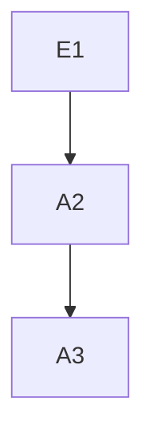

**所有项目下面的README.md文件都应该详细说明项目具体情况，技术文档参考格式如下：**

**项目名称**

<!-- TOC -->

- [1. 项目背景](#1-项目背景)
    - [1.1. 项目提出部门](#11-项目提出部门)
    - [1.2. 项目对接人](#12-项目对接人)
    - [1.3. 主要目标](#13-主要目标)
    - [1.4. 验收标准](#14-验收标准)
- [2. 数据集及预处理说明](#2-数据集及预处理说明)
    - [2.1. 数据来源](#21-数据来源)
    - [2.2. 相关数据表](#22-相关数据表)
    - [2.3. 数据预处理思路](#23-数据预处理思路)
- [3. 算法详情](#3-算法详情)
    - [3.1. 整体思路](#31-整体思路)
    - [3.3. 算法框架图](#33-算法框架图)
    - [3.4. 性能评价准则](#34-性能评价准则)
    - [3.5. 难点分析](#35-难点分析)
    - [3.6. 测试要点](#36-测试要点)
- [4. 结果表](#4-结果表)
- [5. 算法技术栈](#5-算法技术栈)
- [6. 接口信息](#6-接口信息)

<!-- /TOC -->

# 1. 项目背景
## 1.1. 项目提出部门
## 1.2. 项目对接人
## 1.3. 主要目标
## 1.4. 验收标准

# 2. 数据集及预处理说明
## 2.1. 数据来源

## 2.2. 相关数据表
| 表名  | 中文名 | 数据量 |
|-----|-----|-----|
| xxx | xx  | 千万  |

## 2.3. 数据预处理思路
*请使用markdown mermaid展示*

# 3. 算法详情
## 3.1. 整体思路
## 3.3. 算法框架图
## 3.4. 性能评价准则
## 3.5. 难点分析
## 3.6. 测试要点

# 4. 结果表

# 5. 算法技术栈

| 技术描述   | 详情                    |
|--------|-----------------------|
| 使用语言   | Python3.5             |
| 关键第三方包 | Pandas,pymysql,impyla |
| 大数据计算  | HIVE数据仓库              |

# 6. 接口信息

| 接口描述    | 详情         |
|---------|------------|
| 接口名称    | e.g. xxx接口 |
| 输入要求和示例 | e.g. xx图片  |
| 输出结果及示例 | e.g. xx图片  |

